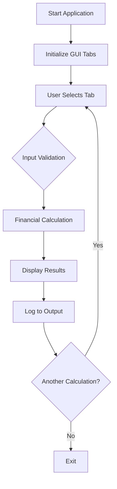

# 💰 Financial Calculator

<div align="center">


**Kalkulator Keuangan Komprehensif - Project Pelatihan FreeCodeCamp**

[Fitur](#-fitur) • [Instalasi](#-instalasi) • [Penggunaan](#-penggunaan) • [Dokumentasi](#-dokumentasi)

</div>

## 📋 Daftar Isi

- [Gambaran Umum](#-gambaran-umum)
- [Fitur](#-fitur)
- [Instalasi](#-instalasi)
- [Penggunaan](#-penggunaan)
- [Dokumentasi](#-dokumentasi)
- [Contoh Penggunaan](#-contoh-penggunaan)
- [FAQ](#-faq)

## 🚀 Gambaran Umum

**Financial Calculator** adalah aplikasi kalkulator keuangan serbaguna yang dibangun dengan Python dan Tkinter. Aplikasi ini dikembangkan sebagai bagian dari pelatihan FreeCodeCamp dan menyediakan enam alat keuangan berbeda dalam satu antarmuka yang user-friendly dengan sistem tab yang terorganisir.

### ✨ Highlights

- 💰 **Six Financial Tools** - Enam alat keuangan dalam satu aplikasi
- 🏠 **Mortgage Calculator** - Kalkulator pinjaman rumah dan KPR
- 📈 **Investment Planning** - Perencanaan investasi dan pensiun
- ⚡ **Rule of 72** - Kalkulator waktu penggandaan investasi
- 🔢 **Mathematical Tools** - Alat matematika untuk analisis lanjutan
- 📊 **Real-time Results** - Hasil perhitungan real-time dengan logging
- 🛡️ **Error Handling** - Validasi input dan penanganan error yang robust
- 🎓 **Educational Purpose** - Cocok untuk pembelajaran finansial literacy

## 🌟 Fitur

### 🤖 Core Features
- **Annuity Calculator** - Perhitungan nilai masa depan anuitas
- **Mortgage Calculator** - Kalkulator angsuran pinjaman bulanan
- **Retirement Planner** - Perencanaan investasi pensiun
- **Doubling Time** - Perhitungan Rule of 72 untuk investasi
- **Logarithmic Solver** - Penyelesaian persamaan logaritmik
- **Scientific Notation** - Konverter notasi ilmiah

### 🛠️ Utility Features
- **🏠 Mortgage Analysis** - Perhitungan angsuran pinjaman dengan berbagai tenor
- **📈 Investment Growth** - Proyeksi pertumbuhan investasi berkala
- **⚡ Quick Doubling** - Estimasi cepat waktu penggandaan modal
- **🔢 Math Tools** - Alat bantu matematika untuk analisis finansial
- **📊 Compound Interest** - Perhitungan bunga majemuk bulanan dan kontinu

### 💾 Data Management
- **Input Validation** - Validasi semua input numerik
- **Error Prevention** - Penanganan division by zero dan invalid input
- **Real-time Logging** - Log detail semua perhitungan
- **Data Persistence** - Nilai default yang reasonable untuk quick start

### 🎨 GUI Features
- **Tabbed Interface** - Antarmuka tab yang terorganisir rapi
- **Clean Layout** - Desain form yang bersih dan intuitif
- **Professional Styling** - Font dan spacing yang konsisten
- **Scrollable Output** - Area output dengan scrolling untuk history
- **Interactive Controls** - Combobox, entry fields, dan buttons

## 📥 Instalasi

### Prerequisites

- Python 3.7 atau lebih tinggi
- Tkinter (biasanya sudah termasuk dalam instalasi Python)

### Step-by-Step Installation

1. **Download Script**
   ```bash
   # Save sebagai: financial_calculator.py
   ```

2. **Verifikasi Dependencies**
   ```bash
   python -c "import tkinter, math; print('Dependencies OK')"
   ```

3. **Run Application**
   ```bash
   python financial_calculator.py
   ```

### Quick Install
```bash
# Langsung jalankan file
python financial_calculator.py
```

## 🎮 Penggunaan

### Menjalankan Aplikasi

```bash
python financial_calculator.py
```

### Basic Usage

1. **Navigasi Tab**
   - Pilih tab sesuai kebutuhan: Annuity, Mortgage, Retirement, dll.
   - Setiap tab memiliki input fields yang spesifik

2. **Input Data**
   - Isi field yang diperlukan dengan nilai numerik
   - Gunakan nilai default sebagai referensi
   - Tekan Enter atau klik Calculate

3. **Hasil Perhitungan**
   - Lihat hasil langsung di bawah tombol calculate
   - Detail perhitungan tercatat di output area bawah

### Tab Overview

| Tab | Function | Key Inputs |
|-----|----------|------------|
| **Annuity** | Nilai masa depan investasi berkala | PV, PMT, Rate, Periods |
| **Mortgage** | Angsuran pinjaman bulanan | Loan Amount, Rate, Years |
| **Retirement** | Perencanaan investasi pensiun | Initial, Monthly, Rate, Years |
| **Doubling Time** | Waktu penggandaan investasi | Rate (%) |
| **Logarithmic** | Penyelesaian persamaan log | Base, Argument |
| **Scientific Notation** | Konversi notasi ilmiah | Standard/Scientific Number |

### Keyboard Shortcuts

| Action | Method |
|--------|--------|
| Navigasi tab | Klik tab atau gunakan mouse |
| Input data | Isi field dan tekan Enter |
| Calculate | Klik tombol Calculate |
| Clear output | Tidak tersedia (manual select-delete) |

## 📚 Dokumentasi

### Workflow Diagram



### Financial Formulas

**Annuity Future Value:**
```python
# Monthly compounding
r = rate / 12
fv = pv * (1 + r)**n + pmt * ((1 + r)**n - 1) / r

# Continuous compounding  
fv = pv * math.exp(rate * n/12) + pmt * (math.exp(rate * n/12) - 1) / (math.exp(rate/12) - 1)
```

**Mortgage Payment:**
```python
r = annual_rate / 12 / 100
n = years * 12
payment = principal * (r * (1 + r)**n) / ((1 + r)**n - 1)
```

**Rule of 72:**
```python
doubling_time = 72 / (annual_rate * 100)
```

## 💡 Contoh Penggunaan

### Contoh 1: Perencanaan Pensiun
```
Tab: Retirement Calculator
Initial Investment: $10,000
Monthly Contribution: $500
Return: 7%
Years: 30

Hasil: Future Balance: $656,383.41
```

### Contoh 2: Kalkulator KPR
```
Tab: Mortgage Calculator  
Loan Amount: $200,000
Rate: 4.5%
Years: 30

Hasil: Monthly Payment: $1,013.37
```

### Contoh 3: Investasi Anuitas
```
Tab: Annuity Calculator
PV: $5,000
PMT: $200
Rate: 5%
Periods: 60
Compounding: monthly

Hasil: Future Value: $18,679.58
```

### Contoh 4: Rule of 72
```
Tab: Doubling Time
Rate: 7%

Hasil: Time to Double: 10.29 years
```

## ❓ FAQ

### Q: Apakah perlu install library tambahan?
**A:** Tidak! Hanya menggunakan Python standard library (tkinter, math).

### Q: Bagaimana cara menghitung bunga efektif?
**A:** Gunakan Annuity Calculator dengan compounding monthly untuk bunga efektif.

### Q: Apa perbedaan compounding monthly vs continuous?
**A:** Monthly: bunga dihitung bulanan, Continuous: bunga dihitung terus-menerus (lebih akurat).

### Q: Bisakah menghitung pinjaman dengan tenor berbeda?
**A:** Ya, ubah input "Years" di Mortgage Calculator untuk tenor yang diinginkan.

### Q: Bagaimana interpretasi hasil doubling time?
**A:** Hasil menunjukkan tahun yang dibutuhkan untuk modal menjadi 2x lipat pada rate tertentu.

### Q: Apa gunanya logarithmic calculator untuk keuangan?
**A:** Untuk menghitung waktu yang dibutuhkan mencapai target investasi (logarithmic growth).

### Q: Bagaimana cara konversi notasi ilmiah?
**A:** Gunakan Scientific Notation tab, input angka standar atau notasi ilmiah (1.23e4).

### Q: Apakah hasil perhitungan sudah termasuk pajak?
**A:** Tidak, hasil bersih sebelum pajak.

---

<div align="center">

*"Compound interest is the eighth wonder of the world. He who understands it, earns it; he who doesn't, pays it." - Albert Einstein*

</div>

---

<div align="center">

**⭐ Jika project ini membantu, beri bintang! ⭐**

</div>