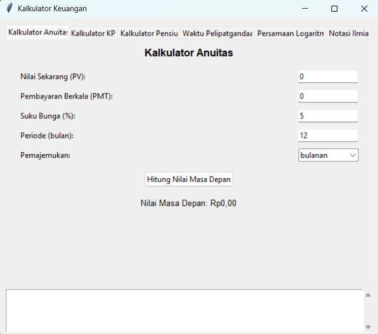
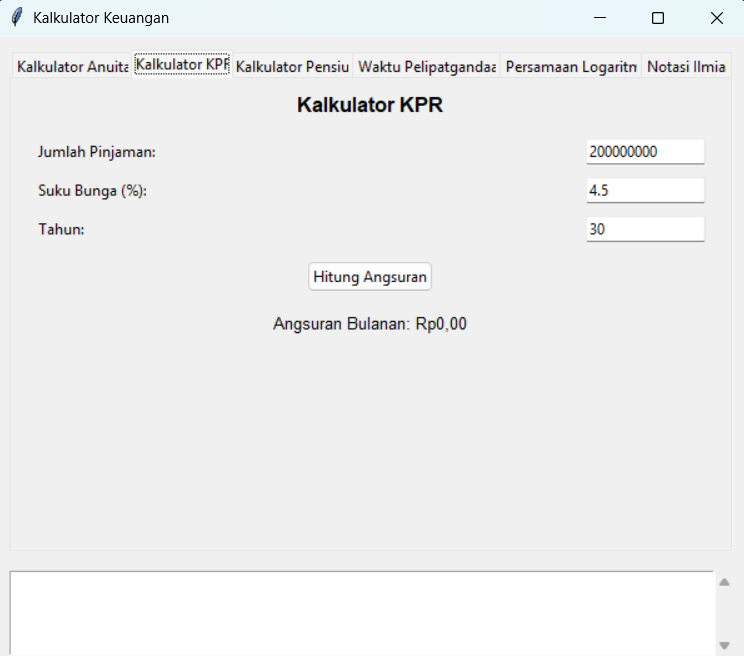
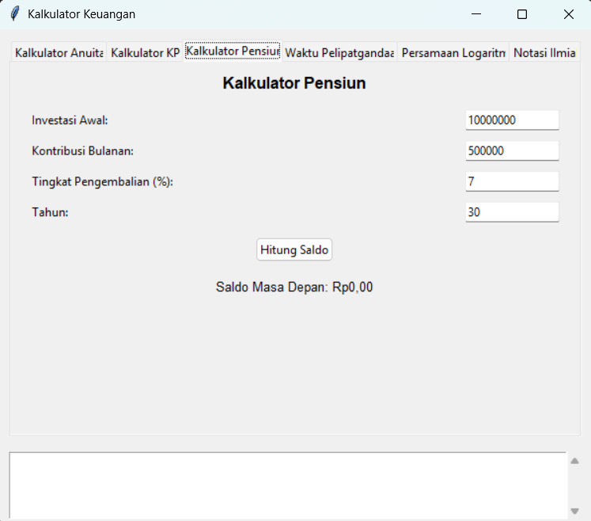
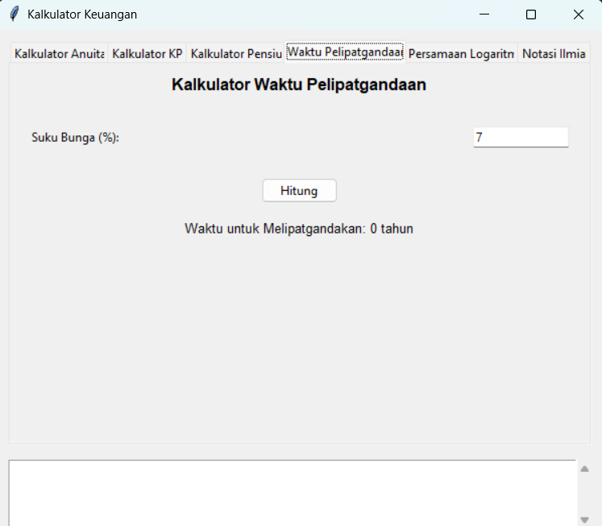
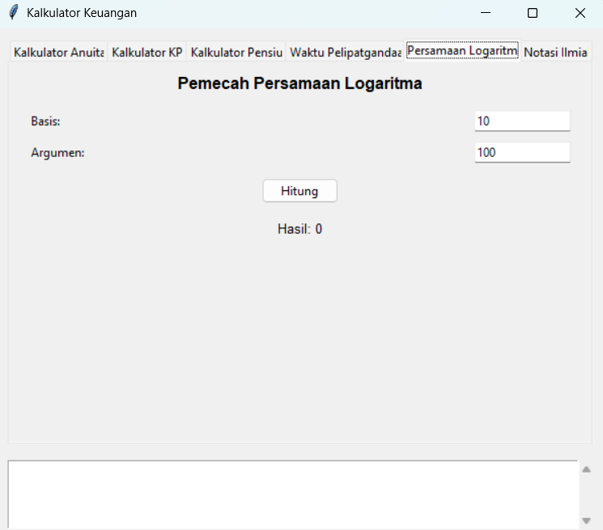
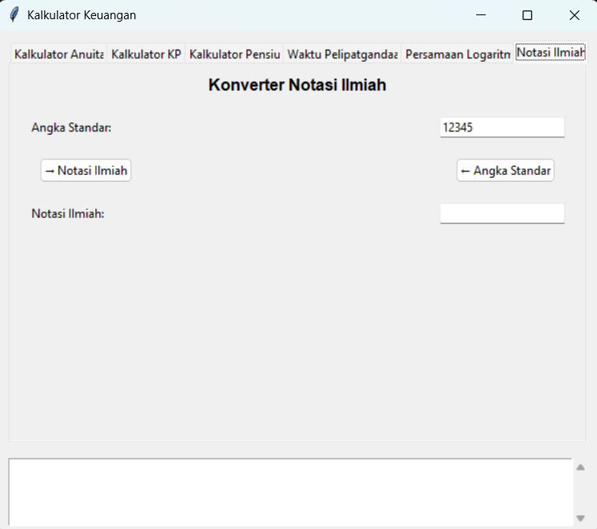
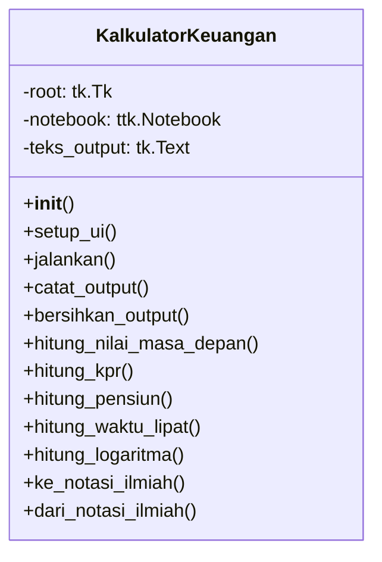
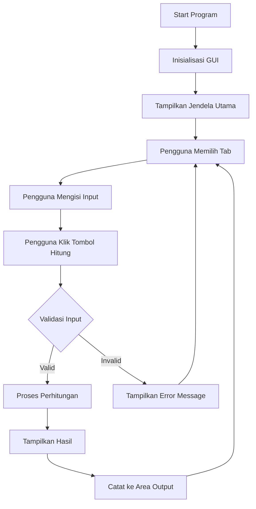

# 💰 Kalkulator Keuangan

<div align="center">


[](https://www.freecodecamp.org/certification/chrisimana/college-algebra-with-python-v8)


**Aplikasi Kalkulator Keuangan berbasis GUI untuk membantu perencanaan keuangan pribadi - Project FreeCodeCamp**

</div>

## 📋 Deskripsi Proyek

**Kalkulator Keuangan** adalah aplikasi berbasis Graphical User Interface (GUI) yang dibangun dengan Python dan Tkinter untuk membantu pengguna dalam melakukan berbagai perhitungan keuangan. Aplikasi ini dikembangkan sebagai bagian dari syarat untuk mendapatkan sertifikat dari FreeCodeCamp. Kalkulator ini menyediakan enam alat keuangan penting dalam satu aplikasi yang mudah digunakan, membantu pengguna merencanakan investasi, menghitung angsuran KPR, merencanakan dana pensiun, dan melakukan berbagai perhitungan matematika keuangan lainnya.

## 📑 Daftar Isi

- [Deskripsi Proyek](#-deskripsi-proyek)
- [Demo](#-demo)
- [Tampilan Aplikasi](#-tampilan-aplikasi)
- [Latar Belakang](#-latar-belakang)
- [Fitur Utama](#-fitur-utama)
- [Teknologi yang Digunakan](#-teknologi-yang-digunakan)
- [Arsitektur](#-arsitektur)
- [Struktur Proyek](#-struktur-proyek)
- [Cara Instalasi](#-cara-instalasi)
- [Cara Penggunaan](#-cara-penggunaan)
- [Pembelajaran dari Proyek](#-pembelajaran-dari-proyek-lessons-learned)
- [Lisensi](#-lisensi)
- [Ucapan Terima Kasih](#-ucapan-terima-kasih)

## 🎮 Demo

Karena aplikasi ini berbasis GUI desktop, tidak ada pratinjau langsung secara *online*. Anda dapat menjalankannya secara lokal di komputer Anda dengan mengikuti petunjuk instalasi pada bagian [Cara Instalasi](#-cara-instalasi--setup). Berikut adalah preview dari tampilan awal aplikasi saat dijalankan:

## 📸 Tampilan Aplikasi

Aplikasi ini memiliki antarmuka berbasis tab (notebook) dengan 6 tab utama. Berikut adalah gambaran visual dari setiap tab:

### Tampilan Utama




### Tab Kalkulator Anuitas

 


### Tab Kalkulator KPR

 


### Tab Kalkulator Pensiun

 


### Tab Kalkulator Waktu Pelipatgandaan

 


### Tab Kalkulator Pemecah Persamaan Logaritma

 


### Tab Kalkulator Konversi Notasi Ilmiah

 


## 🎯 Latar Belakang

Proyek ini dibuat untuk memenuhi kebutuhan akan alat bantu perhitungan keuangan yang komprehensif namun mudah digunakan:

- **Memenuhi syarat sertifikasi FreeCodeCamp** - Sebagai project portfolio untuk mendapatkan sertifikat
- **Membantu perencanaan keuangan pribadi** - Memberikan alat yang dapat digunakan masyarakat umum untuk merencanakan keuangan mereka
- **Edukasi literasi keuangan** - Membantu pengguna memahami konsep-konsep keuangan seperti bunga majemuk, anuitas, dan time value of money
- **Menggabungkan berbagai alat keuangan** - Menyediakan 6 alat keuangan penting dalam satu aplikasi terintegrasi
- **Antarmuka yang ramah pengguna** - Menggunakan GUI agar lebih mudah digunakan dibandingkan kalkulator berbasis terminal


## 🌟 Fitur Utama

### 🏦 Kalkulator Anuitas
- Menghitung nilai masa depan (Future Value) dari anuitas
- Mendukung dua jenis pemajemukan: **bulanan** dan **kontinu**
- Input parameter: Nilai Sekarang (PV), Pembayaran Berkala (PMT), Suku Bunga, Periode

### 🏠 Kalkulator KPR (Kredit Pemilikan Rumah)
- Menghitung angsuran bulanan KPR
- Memperhitungkan pokok pinjaman, suku bunga, dan jangka waktu
- Mendukung perhitungan dengan berbagai skenario pinjaman

### 👴 Kalkulator Pensiun
- Menghitung saldo masa depan dana pensiun
- Mempertimbangkan investasi awal dan kontribusi bulanan
- Menghitung pertumbuhan dengan bunga majemuk

### ⏱️ Kalkulator Waktu Pelipatgandaan
- Menghitung waktu yang diperlukan untuk melipatgandakan investasi
- Menggunakan **Aturan 72** sebagai pendekatan cepat
- Membantu pengguna memahami dampak suku bunga terhadap pertumbuhan investasi

### 📊 Pemecah Persamaan Logaritma
- Menghitung logaritma dengan basis yang dapat ditentukan pengguna
- Validasi input untuk basis dan argumen yang valid
- Berguna untuk perhitungan keuangan yang melibatkan logaritma

### 🔬 Konverter Notasi Ilmiah
- Mengkonversi angka standar ke notasi ilmiah
- Mengkonversi notasi ilmiah kembali ke angka standar
- Mendukung format notasi ilmiah seperti `1.23e4`

## 🛠️ Teknologi yang Digunakan

- **Python 3.7+** - Bahasa pemrograman utama
- **Tkinter** - Library GUI bawaan Python untuk antarmuka pengguna
- **ttk (Themed Tkinter)** - Widget tematik untuk tampilan yang lebih modern
- **Math** - Library bawaan Python untuk fungsi matematika (log, exp, dll)
- **re (Regular Expression)** - Untuk parsing input notasi ilmiah


## 🏗️ Arsitektur / Konsep Sistem

### Struktur Kelas



### Alur Kerja Aplikasi



### Rumus Matematika yang Digunakan

| Fitur | Rumus | Keterangan |
|------|-------|------------|
| **Anuitas (Bulanan)** | `FV = PV(1+r)^n + PMT × ((1+r)^n - 1)/r` | r = bunga/12 |
| **Anuitas (Kontinu)** | `FV = PV × e^(rt) + PMT × (e^(rt) - 1)/(e^(r/12) - 1)` | Pemajemukan kontinu |
| **Angsuran KPR** | `PMT = P × (r(1+r)^n)/((1+r)^n - 1)` | r = bunga/12/bulan |
| **Dana Pensiun** | `FV = P(1+r)^n + C × ((1+r)^n - 1)/r` | Dengan kontribusi bulanan |
| **Aturan 72** | `t = 72 / (r × 100)` | Pendekatan waktu lipat ganda |
| **Logaritma** | `y = log_b(a)` | Menghitung log basis b dari a |

## 📁 Struktur Proyek

```
financial-calculator/
│
├── src/                         # Source code utama
│   └── main.py                  # File utama program kalkulator keuangan
│
├── Screenshot/                  # Screenshot tampilan aplikasi
│   ├── 1.png
│   ├── 2.png
│   ├── 3.png
│   ├── 4.png
│   ├── 5.png
│   └── 6.png
│
├── README.md                    # Dokumentasi proyek
└── LICENSE.md                   # Lisensi proyek (MIT)
```


### Penjelasan File

| File / Folder              | Fungsi                                                                                                                                          |
| -------------------------- | ----------------------------------------------------------------------------------------------------------------------------------------------- |
| `src/main.py`              | Berisi kode utama program                     |
| `Screenshot/`              | Folder yang berisi gambar tangkapan layar aplikasi untuk dokumentasi                                          |
| `Screenshot/1.png – 6.png` | Screenshot tampilan aplikasi |
| `README.md`                | Dokumentasi utama proyek                     |
| `LICENSE.md`               | File lisensi proyek (MIT) MIT).                                    |


## 📥 Cara Instalasi 

### Prasyarat

- **Python 3.7 atau lebih tinggi** - [Download Python](https://www.python.org/downloads/)
- **Tkinter** 
- **Pip** (Python package installer)

### Langkah-langkah Instalasi

1. **Clone Repository**
   ```bash
   git clone https://github.com/Chrisimana/kalkulator-keuangan
   cd kalkulator-keuangan
   ```

2. **Buat Virtual Environment (Opsional)**
   ```bash
   # Windows
   python -m venv venv
   venv\Scripts\activate
   
   # Linux/Mac
   python3 -m venv venv
   source venv/bin/activate
   ```

3. **Jalankan Aplikasi**
   ```bash
   python src/main.py
   ```

### Verifikasi Tkinter

Untuk memastikan Tkinter terinstal dengan benar:

```bash
python -c "import tkinter; tkinter._test()"
```

Jika muncul jendela dialog, maka Tkinter sudah terinstal dengan baik.

## 🎮 Cara Penggunaan

### Menjalankan Aplikasi

```bash
python src/main.py
```

### Navigasi Antar Tab

Aplikasi ini memiliki 6 tab yang dapat dipilih dengan mengklik tab tersebut:

| Tab | Fungsi |
|-----|--------|
| **Kalkulator Anuitas** | Menghitung nilai masa depan anuitas |
| **Kalkulator KPR** | Menghitung angsuran KPR bulanan |
| **Kalkulator Pensiun** | Menghitung saldo dana pensiun |
| **Waktu Pelipatgandaan** | Menghitung waktu lipat ganda investasi |
| **Persamaan Logaritma** | Menyelesaikan persamaan logaritma |
| **Notasi Ilmiah** | Konverter notasi ilmiah |

### Panduan Per Fitur

#### 1. **Kalkulator Anuitas**
| Langkah | Aksi | Contoh |
|---------|------|--------|
| 1 | Isi Nilai Sekarang (PV) | 10,000,000 |
| 2 | Isi Pembayaran Berkala (PMT) | 500,000 |
| 3 | Isi Suku Bunga (%) | 6 |
| 4 | Isi Periode (bulan) | 24 |
| 5 | Pilih jenis Pemajemukan | bulanan / kontinu |
| 6 | Klik "Hitung Nilai Masa Depan" | |
| 7 | Lihat hasil di bawah tombol | RpXX,XXX,XXX |

#### 2. **Kalkulator KPR**
| Langkah | Aksi | Contoh |
|---------|------|--------|
| 1 | Isi Jumlah Pinjaman | 200,000,000 |
| 2 | Isi Suku Bunga (%) | 4.5 |
| 3 | Isi Jangka Waktu (tahun) | 30 |
| 4 | Klik "Hitung Angsuran" | |
| 5 | Lihat hasil angsuran bulanan | Rp1,013,370 |

#### 3. **Kalkulator Pensiun**
| Langkah | Aksi | Contoh |
|---------|------|--------|
| 1 | Isi Investasi Awal | 10,000,000 |
| 2 | Isi Kontribusi Bulanan | 500,000 |
| 3 | Isi Tingkat Pengembalian (%) | 7 |
| 4 | Isi Jangka Waktu (tahun) | 30 |
| 5 | Klik "Hitung Saldo" | |
| 6 | Lihat saldo masa depan | Rp612,345,678 |

#### 4. **Kalkulator Waktu Pelipatgandaan**
| Langkah | Aksi | Contoh |
|---------|------|--------|
| 1 | Isi Suku Bunga (%) | 7 |
| 2 | Klik "Hitung" | |
| 3 | Lihat waktu lipat ganda | 10.29 tahun |

#### 5. **Pemecah Persamaan Logaritma**
| Langkah | Aksi | Contoh |
|---------|------|--------|
| 1 | Isi Basis | 10 |
| 2 | Isi Argumen | 100 |
| 3 | Klik "Hitung" | |
| 4 | Lihat hasil | 2.0000 |

#### 6. **Konverter Notasi Ilmiah**
| Langkah | Aksi | Contoh |
|---------|------|--------|
| 1 | Isi Angka Standar | 12345 |
| 2 | Klik "→ Notasi Ilmiah" | |
| 3 | Lihat notasi ilmiah | 1.2345e4 |
| 4 | Atau isi notasi ilmiah | 1.23e4 |
| 5 | Klik "← Angka Standar" | |
| 6 | Lihat angka standar | 12,300 |

### Area Output

Semua hasil perhitungan akan dicatat di area output (bagian bawah aplikasi) dengan format:
```
Nilai masa depan anuitas dihitung: RpXX,XXX,XXX.XX
Angsuran KPR dihitung: RpXX,XXX,XXX.XX
Saldo pensiun dihitung: RpXX,XXX,XXX.XX
...
```

## 👨‍💻 Peran Developer

Sebagai pengembang tunggal proyek ini, saya bertanggung jawab atas:

- **Perancangan Arsitektur Aplikasi** - Mendesain struktur kelas dan alur kerja aplikasi
- **Pengembangan GUI** - Membangun antarmuka pengguna dengan Tkinter dan ttk widgets
- **Implementasi Algoritma Keuangan** - Menerjemahkan rumus-rumus keuangan ke dalam kode Python
- **Validasi Input** - Membuat sistem validasi untuk mencegah error dan input tidak valid
- **Error Handling** - Menangani exception dengan message box yang informatif
- **User Experience** - Mendesain tata letak yang intuitif dan mudah digunakan
- **Testing** - Melakukan uji coba pada setiap fitur untuk memastikan akurasi perhitungan
- **Dokumentasi** - Membuat dokumentasi proyek yang jelas dan komprehensif

## 📚 Pembelajaran dari Proyek (Lessons Learned)

### Technical Skills

- **GUI Development dengan Tkinter** - Mempelajari cara membuat aplikasi desktop dengan widget-widget Tkinter seperti Notebook, Frame, Label, Entry, Button, Combobox, Text, dan Scrollbar
- **Event-Driven Programming** - Memahami konsep pemrograman berbasis event dengan callback functions
- **StringVar dan Data Binding** - Menggunakan Tkinter variables untuk binding data antar widget
- **Exception Handling** - Menerapkan try-except untuk menangani berbagai jenis error
- **Mathematical Modeling** - Menerjemahkan rumus keuangan kompleks ke dalam kode Python
- **Regular Expressions** - Menggunakan regex untuk parsing input notasi ilmiah

### Soft Skills

- **Problem Solving** - Memecahkan masalah perhitungan keuangan ke dalam langkah-langkah algoritmik
- **UI/UX Design** - Mendesain antarmuka yang intuitif dengan tab organization
- **Code Organization** - Menstruktur kode dengan class dan method yang terpisah berdasarkan fungsi

### Financial Concepts

- **Time Value of Money** - Memahami konsep nilai waktu uang dan bunga majemuk
- **Annuity Calculations** - Mempelajari perhitungan anuitas biasa dan anuitas jatuh tempo
- **Amortization** - Memahami cara kerja amortisasi pinjaman KPR
- **Rule of 72** - Mempelajari aturan praktis untuk menghitung waktu lipat ganda
- **Compound Interest** - Memahami perbedaan pemajemukan diskrit dan kontinu

## 📄 Lisensi

Proyek ini dilisensikan di bawah **MIT License** - lihat file [LICENSE](LICENSE) untuk detail.


## 🙏 Ucapan Terima Kasih

### Institusi
- **FreeCodeCamp** - Atas kurikulum, materi pembelajaran, dan inspirasi proyek yang luar biasa
- **Python Software Foundation** - Atas bahasa pemrograman Python yang powerful dan mudah dipelajari

### Komunitas
- **Python Community** - Atas dokumentasi, tutorial, dan dukungan yang luar biasa
- **Tkinter Community** - Atas resource dan contoh-contoh GUI yang membantu
- **Stack Overflow** - Atas solusi-solusi untuk berbagai masalah coding

### Referensi dan Sumber Belajar
- [Python Official Documentation](https://docs.python.org/3/)
- [Tkinter Documentation](https://docs.python.org/3/library/tkinter.html)
- [Real Python Tutorials](https://realpython.com/)
- [GeeksforGeeks](https://www.geeksforgeeks.org/)
- [Investopedia](https://www.investopedia.com/) - Untuk konsep-konsep keuangan

### Tools
- **Shields.io** - Untuk badges yang keren
- **Mermaid.js** - Untuk diagram alur yang interaktif
- **Visual Studio Code** - Editor kode yang luar biasa
- **GitHub** - Platform hosting dan kolaborasi

---

<div align="center">

**⭐ Jika proyek ini bermanfaat untuk perencanaan keuangan Anda, jangan lupa berikan bintang di GitHub! ⭐**


**"Literasi keuangan adalah kunci menuju kebebasan finansial"**

</div>